# MCP End-to-End Flows

Two separate flows showing how tokens travel through the system.

> **Reading the token boxes:** each `Note` shows the key JWT claims at that point.

---

## Flow 1 — OBO (Delegated User)

User signs in via the Web SPA. The BFF exchanges the user's token for a
downstream token via On-Behalf-Of, preserving the user's identity all the way
to `CMSPDemo-OBOPartnerAPIApp`.

> The OBO exchange is the critical step — user identity (`oid`, `upn`, `tid`) is
> preserved across the hop, and the audience (`aud`) changes. Because the SPA and BFF
> share the `CMSPDemo-BFF` app registration, `appid` is the same in both T1 and T2.

```mermaid
sequenceDiagram
    autonumber

    actor User as User

    participant Web as Web App
    participant Entra as Microsoft Entra ID
    participant BFF as BFF API :5080
    participant PAPI as OBOPartnerAPIApp :5081

    Note over Web,BFF: CMSPDemo-BFF — shared app registration (SPA + confidential BFF)
    Note over PAPI: CMSPDemo-OBOPartnerAPIApp (resource)

    %% ── PHASE 1: User Authentication ─────────────────────────────
    rect rgb(13, 35, 70)
        Note over User,Entra: PHASE 1 — User Authentication via MSAL Popup

        User  ->>  Web   : Open app, enter Client ID, click Sign In
        Web   ->>  Entra : Authorization Request<br/>client_id = CMSPDemo-BFF<br/>scope = openid profile api://BFF-appId/access_as_user<br/>response_type = code + PKCE (S256)<br/>redirect_uri = http://localhost:5173
        Entra ->>  User  : Show login and consent screen
        User  ->>  Entra : Enter credentials (AAD or MSA)
        Entra -->> Web   : Redirect with authorization_code
        Web   ->>  Entra : POST /token<br/>grant_type = authorization_code<br/>code = auth-code, code_verifier = pkce-verifier<br/>client_id = CMSPDemo-BFF
        Entra -->> Web   : id_token + access_token T1

        Note right of Web : T1 — Access Token (scoped to BFF)<br/>aud   = api://BFF-appId<br/>oid   = user-object-id<br/>upn   = user@example.com<br/>tid   = tenant-id<br/>scp   = access_as_user<br/>appid = CMSPDemo-BFF-appId<br/>idtyp = absent (delegated user token)

        Note right of Web : MSAL caches T1 in sessionStorage<br/>Refresh token stored for silent renewal
    end

    %% ── PHASE 2: Web sends MCP request to BFF ────────────────────
    rect rgb(10, 55, 35)
        Note over User,BFF: PHASE 2 — MCP Request: Web → BFF (T1 validated against CMSPDemo-BFF)

        User  ->>  Web   : OBO tab — select MCP OBO preset<br/>method = tools/call, params name = GetCallerClaims
        Web   ->>  Web   : MSAL.acquireTokenSilent<br/>scope = api://BFF-appId/access_as_user<br/>Returns cached T1 or silently refreshes
        Web   ->>  BFF   : POST /api/proxy/mcp-obo<br/>Authorization: Bearer T1<br/>Content-Type: application/json<br/>Accept: application/json, text/event-stream<br/>Body: jsonrpc 2.0 — tools/call — GetCallerClaims

        Note right of BFF : BFF validates T1 via Entra JWKS<br/>aud = api://BFF-appId  OK<br/>iss = .../tenantId/...  OK<br/>sig = valid  OK<br/>exp = not expired  OK

        BFF   ->>  BFF   : BffAuthPolicies.UserToken<br/>scp = access_as_user present  PASS<br/>idtyp absent (not an app token)  PASS<br/>Authorised as delegated user
    end

    %% ── PHASE 3: OBO Token Exchange ──────────────────────────────
    rect rgb(55, 15, 55)
        Note over BFF,Entra: PHASE 3 — On-Behalf-Of Exchange (CMSPDemo-BFF credential used)

        Note left of BFF  : ITokenAcquisition.GetAccessTokenForUserAsync<br/>checks in-memory cache first<br/>Cache miss triggers OBO request

        BFF   ->>  Entra  : POST /tenantId/oauth2/v2.0/token<br/>grant_type = urn:ietf:params:oauth:grant-type:jwt-bearer<br/>client_id = CMSPDemo-BFF-appId<br/>client_secret = BFF-secret<br/>assertion = T1<br/>requested_token_use = on_behalf_of<br/>scope = api://OBOPartnerAPIApp-appId/access_as_user

        Note right of Entra: Entra validates the OBO chain<br/>T1 audience matches BFF  OK<br/>BFF is pre-authorised in OBOPartnerAPIApp  OK<br/>User previously consented  OK<br/>Issues T2 preserving user identity

        Entra -->> BFF    : access_token T2

        Note right of BFF : T2 — OBO Token (scoped to OBOPartnerAPIApp)<br/>aud   = api://OBOPartnerAPIApp-appId  CHANGED<br/>oid   = user-object-id  PRESERVED<br/>upn   = user@example.com  PRESERVED<br/>tid   = tenant-id  PRESERVED<br/>scp   = access_as_user  PRESERVED<br/>appid = CMSPDemo-BFF-appId  SAME as Web token (shared registration)<br/>idtyp = absent (still a delegated user token)<br/>KEY INSIGHT: user identity survives the hop; appid unchanged (shared registration)

        Note left of BFF  : MIDW caches T2 keyed by user-oid x tenant x scope<br/>Subsequent calls reuse T2 until near-expiry
    end

    %% ── PHASE 4: MCP Call to OBOPartnerAPIApp ────────────────────
    rect rgb(60, 35, 10)
        Note over BFF,PAPI: PHASE 4 — MCP Streamable HTTP: BFF → OBOPartnerAPIApp (T2 validated)

        BFF   ->>  PAPI   : POST /mcp/obo<br/>Authorization: Bearer T2<br/>Content-Type: application/json<br/>Accept: application/json, text/event-stream<br/>Mcp-Session-Id: session-id (if resuming)<br/>Body: jsonrpc 2.0 — tools/call — GetCallerClaims

        Note right of PAPI: Validates T2 via Entra JWKS<br/>aud = api://OBOPartnerAPIApp-appId  OK<br/>iss = .../tenantId/...  OK

        PAPI  ->>  PAPI   : AuthPolicies.OboOnly<br/>scp = access_as_user present  PASS<br/>idtyp absent (not an app token)  PASS<br/>OBO user context confirmed

        PAPI  ->>  PAPI   : tools/call → ClaimsTools.GetCallerClaims()<br/>Reads HttpContext.User claims from T2<br/>name  = user@example.com<br/>oid   = user-object-id<br/>tid   = tenant-id<br/>appid = CMSPDemo-BFF-appId (acting app)<br/>scp   = access_as_user<br/>flavor = mcp-obo
    end

    %% ── PHASE 5: SSE Streaming Response ──────────────────────────
    rect rgb(10, 45, 60)
        Note over User,PAPI: PHASE 5 — SSE Streaming Response: OBOPartnerAPIApp → BFF → Web

        PAPI  -->> BFF    : HTTP 200 text/event-stream<br/>Mcp-Session-Id: session-id<br/>data: jsonrpc 2.0 result — ClaimsResponse JSON<br/>data: [DONE]

        Note left of BFF  : ProxyToAsync — no buffering<br/>Headers and body piped socket-to-socket<br/>from OBOPartnerAPIApp to Web

        BFF   -->> Web    : HTTP 200 text/event-stream forwarded verbatim<br/>Same Mcp-Session-Id and SSE payload

        Web   ->>  Web    : Parses MCP JSON-RPC result<br/>Displays ClaimsResponse in OBO tab<br/>Network tab captures full roundtrip

        Web   -->> User   : Claims displayed<br/>name, oid, tid, scp, appid=BFF, flavor=mcp-obo
    end
```

### OBO token claims across hops

| Claim | T1 — BFF (SPA client) | T2 — BFF → OBOPartnerAPIApp (OBO) |
|-------|-------------------|-----------------------------------|
| `aud` | `api://BFF-appId` | `api://OBOPartnerAPIApp-appId` |
| `appid` | CMSPDemo-**BFF** (SPA client) | CMSPDemo-**BFF** (OBO exchange) |
| `idtyp` | absent | absent |
| `scp` | `access_as_user` | `access_as_user` |
| `roles` | absent | absent |
| `oid` | user OID ✅ | user OID ✅ preserved |
| `upn` | user UPN ✅ | user UPN ✅ preserved |
| `tid` | tenant ID ✅ | tenant ID ✅ preserved |

> **Why `appid` does NOT change across the OBO hop (shared registration):**
> Because the Web SPA and the BFF share the same app registration (`CMSPDemo-BFF`),
> `appid` is identical in T1 and T2 — both show `CMSPDemo-BFF-appId`.
> Only `aud` changes across the hop (from `api://BFF-appId` to `api://OBOPartnerAPIApp-appId`).
> The BFF still supplies its own `client_id` and `client_secret` in the OBO grant to prove
> it is a confidential client, but since it shares the app ID with the SPA the `appid` claim
> appears unchanged. User identity (`oid`, `upn`, `tid`) is preserved as usual.

---

## Flow 2 — S2S (Service-to-Service, App-Only)

`CMSPDemo-S2SPartnerAPIApp` authenticates directly to Entra using a Key Vault
certificate, acquires an app-only token, and calls `CMSPDemo-OBOPartnerAPIApp`
with no user identity in the token.

```mermaid
sequenceDiagram
    autonumber

    participant S2S as S2SPartnerAPIApp
    participant KV as Azure Key Vault
    participant Entra as Microsoft Entra ID
    participant PAPI as OBOPartnerAPIApp :5081

    Note over S2S:  CMSPDemo-S2SPartnerAPIApp (confidential, cert)
    Note over PAPI: CMSPDemo-OBOPartnerAPIApp (resource)

    %% ── PHASE 1: Certificate retrieval ───────────────────────────
    rect rgb(13, 35, 70)
        Note over S2S,KV: PHASE 1 — Load Certificate from Key Vault

        S2S   ->>  KV    : DefaultAzureCredential → GET cmspdemo-s2s-cert<br/>CertificateClient.GetCertificate()<br/>SecretClient.GetSecret() for private key (PFX)
        KV    -->> S2S   : PFX bundle (cert + private key)<br/>Private key never leaves Azure Key Vault boundary

        Note right of S2S : X509Certificate2 loaded into memory<br/>Used to sign the client_assertion JWT<br/>Discarded after token acquisition
    end

    %% ── PHASE 2: Token acquisition ───────────────────────────────
    rect rgb(55, 15, 55)
        Note over S2S,Entra: PHASE 2 — Client Credentials Grant (certificate assertion)

        S2S   ->>  Entra  : POST /tenantId/oauth2/v2.0/token<br/>grant_type = client_credentials<br/>client_id = CMSPDemo-S2SPartnerAPIApp-appId<br/>client_assertion_type = urn:ietf:params:oauth:client-assertion-type:jwt-bearer<br/>client_assertion = JWT signed with KV cert<br/>scope = api://OBOPartnerAPIApp-appId/.default

        Note right of Entra: Validates client_assertion signature<br/>Checks S2SPartnerAPIApp has CMSPDemo.S2S role<br/>on OBOPartnerAPIApp  OK<br/>Issues T3 — no user context

        Entra -->> S2S    : access_token T3

        Note right of S2S : T3 — App-Only Token<br/>aud   = api://OBOPartnerAPIApp-appId<br/>appid = CMSPDemo-S2SPartnerAPIApp-appId<br/>idtyp = app  KEY CLAIM<br/>roles = CMSPDemo.S2S<br/>oid   = S2SPartnerAPIApp service principal oid<br/>scp   = absent (no delegated scopes)<br/>upn   = absent (no user identity)
    end

    %% ── PHASE 3: MCP Call ────────────────────────────────────────
    rect rgb(60, 35, 10)
        Note over S2S,PAPI: PHASE 3 — MCP Streamable HTTP: S2SPartnerAPIApp → OBOPartnerAPIApp

        S2S   ->>  PAPI   : POST /mcp/s2s<br/>Authorization: Bearer T3<br/>Content-Type: application/json<br/>Accept: application/json, text/event-stream<br/>Body: jsonrpc 2.0 — tools/call — GetCallerClaims

        Note right of PAPI: Validates T3 via Entra JWKS<br/>aud = api://OBOPartnerAPIApp-appId  OK

        PAPI  ->>  PAPI   : AuthPolicies.S2SOnly<br/>idtyp = app  PASS<br/>roles = CMSPDemo.S2S  PASS<br/>scp absent (no delegated scope)  PASS

        Note right of PAPI: If token hits /mcp/obo instead:<br/>OboOnly policy — scp absent  FAIL → 403<br/>S2SPartnerAPIApp cannot access /mcp/obo by design

        PAPI  ->>  PAPI   : tools/call → ClaimsTools.GetCallerClaims()<br/>Reads HttpContext.User claims from T3<br/>appid = CMSPDemo-S2SPartnerAPIApp-appId<br/>oid   = S2SPartnerAPIApp SP oid<br/>roles = CMSPDemo.S2S<br/>upn   = absent<br/>flavor = mcp-s2s
    end

    %% ── PHASE 4: SSE Streaming Response ──────────────────────────
    rect rgb(10, 45, 60)
        Note over S2S,PAPI: PHASE 4 — SSE Streaming Response: OBOPartnerAPIApp → S2SPartnerAPIApp

        PAPI  -->> S2S    : HTTP 200 text/event-stream<br/>Mcp-Session-Id: session-id<br/>data: jsonrpc 2.0 result — ClaimsResponse JSON<br/>data: [DONE]

        Note right of S2S : No user claims in response<br/>Only app identity: appid, oid, roles, flavor=mcp-s2s
    end
```



### S2S token claims

| Claim | T3 — S2SPartnerAPIApp → OBOPartnerAPIApp |
|-------|------------------------------------------|
| `aud` | `api://OBOPartnerAPIApp-appId` |
| `appid` | CMSPDemo-**S2SPartnerAPIApp** |
| `idtyp` | **`app`** |
| `scp` | absent |
| `roles` | `CMSPDemo.S2S` |
| `oid` | S2SPartnerAPIApp service principal OID |
| `upn` | absent |
| `tid` | tenant ID |

---

## Authorization policy gate summary

| Route | Policy | Accepts | Rejects |
|-------|--------|---------|---------|
| BFF `/api/proxy/*` | `BffAuthPolicies.UserToken` | `scp` present, `idtyp` absent | `idtyp=app` |
| OBOPartnerAPIApp `/mcp/obo` | `AuthPolicies.OboOnly` | `scp` present, `idtyp` absent | `idtyp=app` |
| OBOPartnerAPIApp `/mcp/s2s` | `AuthPolicies.S2SOnly` | `idtyp=app` + `roles` present | delegated tokens |

## Key difference between OBO and S2S

| | OBO (Flow 1) | S2S (Flow 2) |
|-|-------------|-------------|
| User identity preserved? | ✅ Yes (`oid`, `upn` in token) | ❌ No (only app SP `oid`) |
| `idtyp` claim | absent | `app` |
| `scp` claim | `access_as_user` | absent |
| `roles` claim | absent | `CMSPDemo.S2S` |
| Who calls OBOPartnerAPIApp? | BFF (acting on behalf of user) | S2SPartnerAPIApp (acting as itself) |
| Reachable endpoint | `/mcp/obo` | `/mcp/s2s` |
| Blocked endpoint | `/mcp/s2s` (no `roles`) | `/mcp/obo` (`idtyp=app` rejected) |
