# MCS Bot → MCP Server (MSA user) via Azure Function token broker

End-to-end design for letting an MCS (Microsoft Copilot Studio) bot call an
OBO-only MCP server when the signed-in user is a **personal Microsoft account
(MSA)**, despite MCS not natively supporting MSA OBO token issuance today.

> **Status:** design proposal. Items in **§ Verification needed** should be
> validated against the current MCS / Power Platform behavior before
> implementation, because Copilot Studio capabilities evolve.

---

## 1. Problem statement

The existing CMSPDemo OBO chain is:

```
Web SPA ── T1 (aud=BFF) ──▶ BFF ── T2 (OBO, aud=OBOPartnerAPI) ──▶ MCP /mcp/obo
```

We now want to extend this so an **MCS bot** can also reach `/mcp/obo` on
behalf of the same user. The natural chain becomes:

```
Web SPA → Omnichannel Widget → MCS Bot → ??? → MCP /mcp/obo
```

But MCS today **cannot generate an OBO token for a personal MSA user** (see
§ 2). The downstream `/mcp/obo` endpoint requires `scp` present and `idtyp`
absent — i.e. a delegated user token — so we cannot work around it by
sending an app token.

**Solution:** introduce an **Azure Function** that performs the OBO exchange.
MCS calls the Function with the user's access token, the Function performs
the OBO exchange and **returns the OBO access token to MCS**, and MCS then
calls the MCP server itself using its built-in **MCP server tool** with that
token attached.

How the SPA hands the user's token to Omnichannel can be done in **two
modes** — Token Response (client-side) or Token Exchange (server-side).
Both are covered here; see § 5 for the comparison.

---

## 2. Why MCS can't do this directly (current understanding)

1. MCS's Generic OAuth 2.0 provider can acquire a user token, but MCS does
   not run a confidential client with a client secret in your tenant, so it
   cannot execute the `urn:ietf:params:oauth:grant-type:jwt-bearer` (OBO)
   grant itself.
2. The OBO grant for an MSA user requires both the source and target app
   registrations to allow MSA (`AzureADandPersonalMicrosoftAccount` sign-in
   audience). MCS-managed registrations rarely have that.
3. MCS's MCP connector can attach a Bearer token from a variable, but it has
   no built-in way to obtain that token via OBO.

Net: the OBO **must happen in code we own** — the Azure Function.

---

## 3. App registrations (final picture)

Only **two** app registrations are used across all the moving parts. Each is
shared by exactly two components.

| App registration | Shared by | Audience | Credential | Notes |
|---|---|---|---|---|
| **`CMSPDemo-BFF`** | Web SPA + BFF API | `AzureADandPersonalMicrosoftAccount` | client secret | Existing. SPA platform `http://localhost:5173` + confidential platform for OBO. Exposes scope `access_as_user`. |
| **`CMSPDemo-MCSApp`** | MCS Bot + Azure Function | `AzureADandPersonalMicrosoftAccount` | client secret | **NEW.** Bot uses its Generic OAuth provider to acquire tokens at `api://CMSPDemo-MCSApp/access_as_user`. Function validates those tokens and OBO-exchanges them using the same app's client secret. |
| `CMSPDemo-OBOPartnerAPIApp` | MCP server only | **must change to** `AzureADandPersonalMicrosoftAccount` | client secret | OBO target. Audience must allow MSA for the OBO chain to succeed. Pre-authorizes `CMSPDemo-BFF` **and** `CMSPDemo-MCSApp` on `access_as_user`. |
| `CMSPDemo-S2SPartnerAPIApp` | (unchanged) | `AzureADMyOrg` | KV cert | Not in this flow. |

### `CMSPDemo-MCSApp` configuration

- **Sign-in audience:** `AzureADandPersonalMicrosoftAccount`
- **Authentication > Platform configurations:** Web platform (confidential
  client). No SPA platform.
- **Expose an API:**
  - Application ID URI: `api://<MCSApp-app-id>`
  - Scope `access_as_user`, type `User`, admin + user consent enabled.
- **API permissions:**
  - `CMSPDemo-OBOPartnerAPIApp` / `access_as_user` (Delegated). **Admin
    consented.**
- **Pre-authorized client applications:** the MCS-published Generic OAuth
  client id (so end users see no second consent prompt when MCS asks for
  `api://<MCSApp>/access_as_user`).
- **Certificates & secrets:** one client secret, stored in Key Vault. Used
  by both the MCS Generic OAuth provider config and the Function App
  Settings.

---

## 4. Transaction-by-transaction walk-through

Every network call between components, in order. **Scope** = the OAuth
`scope` parameter used when *acquiring* a token. **Audience** = the `aud`
claim of the *resulting* token.

**Steps 1–4 and 8–13 are the same in both modes.** Steps 5–7 are where
Token Response and Token Exchange diverge — see § 5 for the full
comparison.

| # | From → To | Endpoint | Method | Headers (key ones) | Body | Token acquired / used | Scope requested | Resulting audience |
|---|---|---|---|---|---|---|---|---|
| **1** | User → Web SPA | `http://localhost:5173` | GET | — | — | — | — | — |
| **2** | Web SPA → Entra | `…/common/oauth2/v2.0/authorize` then `/token` | GET → POST | PKCE S256 | code+verifier | **acquires `T_bff`** | `openid profile offline_access api://CMSPDemo-BFF/access_as_user` | `api://CMSPDemo-BFF` |
| **3** | Web SPA → BFF | `http://localhost:5080/api/...` | * | `Authorization: Bearer T_bff` | * | uses `T_bff` | — | — |
| **4** | User → Web SPA | "Open Chat" button | — | — | — | — | — | — |
| **5R** | *(Token Response)* Web SPA → Entra | `…/common/oauth2/v2.0/token` (silent) | POST | — | — | **SPA acquires `T_mcs` directly** | `openid profile offline_access api://CMSPDemo-MCSApp/access_as_user` | `api://CMSPDemo-MCSApp` |
| **5X** | *(Token Exchange)* Omnichannel → BFF | `https://<bff-host>/api/widget/exchange-token` | POST | `Authorization: Bearer T_bff` `Content-Type: application/json` | `{ "targetScope": "api://CMSPDemo-MCSApp/access_as_user" }` | Omnichannel forwards `T_bff` | — | — |
| **6X** | *(Token Exchange)* BFF → Entra | `…/common/oauth2/v2.0/token` | POST | `Content-Type: application/x-www-form-urlencoded` | `grant_type=jwt-bearer&client_id=<BFF>&client_secret=***&assertion=T_bff&scope=api://CMSPDemo-MCSApp/access_as_user&requested_token_use=on_behalf_of` | **BFF acquires `T_mcs`** via OBO | `api://CMSPDemo-MCSApp/access_as_user` | `api://CMSPDemo-MCSApp` |
| **7X** | *(Token Exchange)* BFF → Omnichannel | (response to 5X) | 200 | `Content-Type: application/json` | `{ "token": "T_mcs", "expiresOn": "…" }` | returns `T_mcs` | — | — |
| **6** | Web SPA → Omnichannel SAS endpoint | Omnichannel session URL (chat init) | POST | — | session metadata + `authenticatedUserToken: T_mcs` (Response) or token-exchange URL (Exchange) | **posts `T_mcs`** | — | — |
| **7** | Omnichannel → MCS Bot | (Omnichannel internal) | — | — | session payload incl. `T_mcs` | — | — | — |
| **8** | MCS Bot → Azure Function | `https://<func-host>/api/obo-exchange` | POST | `Authorization: Bearer T_mcs` `Content-Type: application/json` | `{ "targetScope": "api://CMSPDemo-OBOPartnerAPIApp/access_as_user" }` | sends `T_mcs` | — | — |
| **9** | Function (validates `T_mcs`) → Entra | `…/common/oauth2/v2.0/token` | POST | `Content-Type: application/x-www-form-urlencoded` | `grant_type=jwt-bearer&client_id=<MCSApp>&client_secret=***&assertion=T_mcs&scope=api://CMSPDemo-OBOPartnerAPIApp/access_as_user&requested_token_use=on_behalf_of` | **acquires `T_mcp`** via OBO | `api://CMSPDemo-OBOPartnerAPIApp/access_as_user` | `api://CMSPDemo-OBOPartnerAPIApp` |
| **10** | Function → MCS Bot | (response to #8) | 200 | `Content-Type: application/json` | `{ "accessToken": "T_mcp", "expiresOn": "…", "tokenType": "Bearer" }` | returns `T_mcp` | — | — |
| **11** | MCS Bot → MCP Server | `https://<mcp-host>/mcp/obo` | POST | `Authorization: Bearer T_mcp` `Accept: application/json, text/event-stream` | `{ "jsonrpc":"2.0", "id":"…", "method":"tools/call", "params": {...} }` | uses `T_mcp` | — | — |
| **12** | MCP Server → MCS Bot | (response to #11) | 200 | `Content-Type: text/event-stream` (or `application/json`) | MCP tool result | — | — | — |
| **13** | MCS Bot → Widget → User | (Omnichannel reply) | — | — | bot message text | — | — | — |

### Quick reference — which token goes where

| Token | `aud` | Acquired by | Carried in |
|---|---|---|---|
| `T_bff` | `api://CMSPDemo-BFF` | SPA via MSAL | Web → BFF calls (Authorization header). In **Mode B**, also POSTed by Omnichannel to BFF's `/api/widget/exchange-token` as the OBO assertion. |
| **`T_mcs`** | `api://CMSPDemo-MCSApp` | **Mode A:** SPA via MSAL. **Mode B:** BFF via OBO (`T_bff` → `T_mcs`). | **Posted to Omnichannel session as `authenticatedUserToken`** (Mode A) or **returned from BFF exchange endpoint to Omnichannel** (Mode B). Either way it arrives in MCS as `{Identity.AccessToken}` and is sent to the Function as Bearer in step 8. |
| **`T_mcp`** | `api://CMSPDemo-OBOPartnerAPIApp` | Function via OBO (`T_mcs` → `T_mcp`) | Returned to MCS in step 10; sent to MCP server as Bearer in step 11. |

---

## 5. Token Response vs Token Exchange — choosing how `T_mcs` gets to Omnichannel

The Omnichannel Live Chat SDK lets the host page provide the authenticated
user's token to Omnichannel in **two ways**. Both end with Omnichannel
holding `T_mcs` (audience = `api://CMSPDemo-MCSApp`) — only the path differs.

### 5.1 Mode A — Token Response (client-side acquisition)

The SPA acquires `T_mcs` directly via MSAL and returns it from
`CMSP_AUTH_CALLBACK`. Omnichannel calls the callback whenever it needs a
fresh token; nothing else server-side is involved for the chat auth step.

```
SPA ── MSAL.acquireTokenSilent(api://CMSPDemo-MCSApp/access_as_user) ──▶ Entra
SPA ── CMSP_AUTH_CALLBACK returns T_mcs ──▶ Omnichannel widget
```

**Pros**
- Simplest wiring. No new server endpoint.
- SPA holds both tokens (`T_bff`, `T_mcs`); Omnichannel only ever sees `T_mcs`.

**Cons**
- SPA code knows the MCSApp scope (one more environment variable).
- Token acquisition policy lives in the browser — harder to audit / change
  centrally.
- The browser holds `T_mcs` for the lifetime of the chat session.

### 5.2 Mode B — Token Exchange (server-side OBO)

The SPA only ever holds `T_bff`. When Omnichannel needs an authenticated
user token, it **POSTs `T_bff` to a BFF endpoint** that performs an OBO
exchange (`T_bff` → `T_mcs`) and returns `T_mcs`. Omnichannel never calls
the SPA back; it talks directly to the BFF.

```
Omnichannel ── POST /api/widget/exchange-token (Bearer T_bff) ──▶ BFF
BFF ── OBO grant (assertion=T_bff, scope=api://MCSApp/...) ──▶ Entra
BFF ── { token: T_mcs } ──▶ Omnichannel
```

**Pros**
- Centralizes all OBO logic in the BFF — single audit point.
- SPA stays scope-agnostic (only knows `T_bff`).
- Easier to rotate / change downstream audiences without touching the SPA.

**Cons**
- New BFF endpoint required (`POST /api/widget/exchange-token`).
- BFF must have delegated permission on MCSApp (and MCSApp must
  pre-authorize BFF) — see § 5.4 below.
- Two OBO hops in total per chat: `BFF→MCSApp` (this exchange) plus
  `MCSApp→OBOPartnerAPI` (the Function's exchange later).

### 5.3 Side-by-side comparison

| Aspect | Token Response (5.1) | Token Exchange (5.2) |
|---|---|---|
| Who acquires `T_mcs` | SPA (browser, MSAL) | BFF (server, OBO) |
| Endpoint involved at chat-init | None extra | `POST /api/widget/exchange-token` on BFF |
| What's in the browser | `T_bff` + `T_mcs` | `T_bff` only |
| What Omnichannel posts to your server | nothing extra | `T_bff` (server unwraps to `T_mcs`) |
| Best when | Simple POC; trust the browser; minimize server endpoints | Multiple front-ends; centralized auth; auditability matters |
| Failure mode | MSAL silent-renew fails → callback returns null → chat re-auth | BFF endpoint down → chat re-auth |
| Token rotation | Re-call `CMSP_AUTH_CALLBACK` | Omnichannel re-hits the exchange URL |

### 5.4 Extra permissions required for Token Exchange

Token Response uses only the existing `BFF → OBOPartnerAPI` and `MCSApp →
OBOPartnerAPI` permissions. Token Exchange adds one more delegated edge:

| From | To | Permission | Why |
|---|---|---|---|
| `CMSPDemo-BFF` | `CMSPDemo-MCSApp` | Delegated: `access_as_user` | BFF performs OBO with target audience = MCSApp |

`CMSPDemo-MCSApp` must list `CMSPDemo-BFF` in its **pre-authorized client
applications** for that scope, otherwise the OBO grant returns
`AADSTS65001` (consent required).

---

## 6. What MCS uses to call the MCP server

Copilot Studio now ships first-class MCP support. **Use the built-in MCP
server tool** (a.k.a. "MCP server" custom connector) rather than a hand-rolled
HTTP action — it understands the JSON-RPC envelope, the SSE transport, and
auto-discovers `tools/list`.

### Adding the MCP server to your Copilot Studio agent

1. In Copilot Studio, open your agent → **Tools** → **+ Add a tool** →
   **Model Context Protocol**.
2. Fill in:
   - **Name:** `CMSPDemo MCP (OBO)`
   - **Server URL:** `https://<obopartnerapi-host>/mcp/obo`
   - **Authentication:** *Custom header* → `Authorization` → value bound to
     the topic variable `Topic.OboToken` formatted as `Bearer {x:Topic.OboToken}`.
   - (If your tenant's Copilot Studio doesn't allow a variable in the header
     yet, fall back to the **HTTP request** action — see § 6.1.)
3. Save. Copilot Studio will hit `tools/list` once (with whatever token is
   set on the connection) and surface the MCP tools (`GetCallerClaims`,
   `WhoAmI`, `Echo`) as agent actions.

### 6.1 Fallback: HTTP request action

If your Copilot Studio environment doesn't yet support MCP connectors with
variable-bound headers, use the topic-level **Send HTTP request** action:

- Method `POST`
- URL `https://<obopartnerapi-host>/mcp/obo`
- Headers:
  - `Authorization: Bearer {Topic.OboToken}`
  - `Content-Type: application/json`
  - `Accept: application/json, text/event-stream`
- Body (JSON):
  ```json
  {
    "jsonrpc": "2.0",
    "id":      "{Topic.CorrelationId}",
    "method":  "tools/call",
    "params":  { "name": "GetCallerClaims", "arguments": {} }
  }
  ```
- Parse response as JSON and render `result.content[0].text` back to the user.

---

## 7. End-to-end sequence diagrams

Two diagrams: one per auth mode. Phases 3–6 (Function call, OBO, MCP call,
render) are identical; only Phase 2 differs.

### 7.1 Mode A — Token Response (client-side acquisition)

```mermaid
sequenceDiagram
    autonumber

    actor User as User (MSA, e.g. user@outlook.com)
    participant Web as Web SPA
    participant Entra as Microsoft Entra ID
    participant Widget as Omnichannel Widget
    participant Omni as Omnichannel Session API
    participant MCS as MCS Bot
    participant Func as Azure Function
    participant MCP as MCP Server (/mcp/obo)

    Note over Web,MCS: CMSPDemo-BFF (Web + BFF)  •  CMSPDemo-MCSApp (Bot + Function)
    Note over MCP: CMSPDemo-OBOPartnerAPIApp

    rect rgb(13, 35, 70)
        Note over User,Entra: PHASE 1 — User sign-in (common authority, MSA allowed)
        User  ->>  Web    : Open SPA, click Sign in
        Web   ->>  Entra  : Auth-code + PKCE<br/>client_id = CMSPDemo-BFF<br/>scope = api://CMSPDemo-BFF/access_as_user
        Entra -->> Web    : T_bff (aud = api://CMSPDemo-BFF)
    end

    rect rgb(10, 55, 35)
        Note over Web,Omni: PHASE 2 (Token Response) — SPA acquires T_mcs and hands it to the widget
        User   ->> Web     : Click Open Chat
        Web    ->> Entra   : MSAL.acquireTokenSilent<br/>scope = api://CMSPDemo-MCSApp/access_as_user
        Entra  -->> Web    : T_mcs (aud = api://CMSPDemo-MCSApp)
        Web    ->> Widget  : CMSP_AUTH_CALLBACK returns T_mcs
        Widget ->> Omni    : POST chat session<br/>authenticatedUserToken = T_mcs
        Omni   ->> MCS     : Hand off session to bot<br/>Identity.AccessToken = T_mcs
    end

    rect rgb(55, 15, 55)
        Note over MCS,Func: PHASE 3 — Bot calls Function to get an OBO token
        MCS  ->> Func : POST /api/obo-exchange<br/>Authorization: Bearer T_mcs<br/>Body: { targetScope: api://OBOPartnerAPIApp/access_as_user }
        Func ->> Func : Validate T_mcs<br/>aud = api://CMSPDemo-MCSApp OK<br/>scp = access_as_user OK<br/>idtyp absent OK
    end

    rect rgb(55, 35, 10)
        Note over Func,Entra: PHASE 4 — On-Behalf-Of grant
        Func  ->> Entra : POST /common/oauth2/v2.0/token<br/>grant_type = jwt-bearer<br/>client_id = CMSPDemo-MCSApp<br/>client_secret = ******<br/>assertion = T_mcs<br/>scope = api://CMSPDemo-OBOPartnerAPIApp/access_as_user<br/>requested_token_use = on_behalf_of
        Entra -->> Func : T_mcp (aud = OBOPartnerAPIApp, oid/upn/tid preserved)
        Func  -->> MCS  : { accessToken: T_mcp, expiresOn, tokenType: Bearer }
    end

    rect rgb(10, 45, 60)
        Note over MCS,MCP: PHASE 5 — Bot calls MCP via the MCP connector (or HTTP action)
        MCS ->> MCP : POST /mcp/obo<br/>Authorization: Bearer T_mcp<br/>JSON-RPC: tools/call → GetCallerClaims
        MCP ->> MCP : OboOnly policy → PASS (scp + no idtyp)
        MCP -->> MCS : text/event-stream → MCP result
    end

    rect rgb(60, 35, 10)
        Note over MCS,User: PHASE 6 — Render
        MCS -->> Widget : Bot message containing the MCP result
        Widget -->> User : Renders in chat bubble
    end
```



### 7.2 Mode B — Token Exchange (server-side OBO)

Only **Phase 2** differs from Mode A. Phases 1, 3, 4, 5, 6 are identical;
omitted here for brevity (see § 7.1).

```mermaid
sequenceDiagram
    autonumber

    actor User as User (MSA)
    participant Web as Web SPA
    participant Entra as Microsoft Entra ID
    participant Widget as Omnichannel Widget
    participant Omni as Omnichannel Session API
    participant BFF as BFF API :5080
    participant MCS as MCS Bot

    Note over Web,BFF: CMSPDemo-BFF (Web + BFF — shared registration)
    Note over MCS:    CMSPDemo-MCSApp

    rect rgb(13, 35, 70)
        Note over User,Entra: PHASE 1 — User sign-in (same as 7.1)
        User  ->>  Web   : Sign in
        Entra -->> Web   : T_bff (aud = api://CMSPDemo-BFF)
    end

    rect rgb(10, 55, 35)
        Note over Web,MCS: PHASE 2 (Token Exchange) — BFF performs OBO to mint T_mcs server-side

        User   ->>  Web    : Click Open Chat
        Web    ->>  Widget : Init Live Chat SDK<br/>tokenExchangeUrl = https://bff/api/widget/exchange-token<br/>getAuthToken = () => T_bff

        Widget ->>  Omni   : startChat({ authToken: T_bff,<br/>tokenExchangeUrl })
        Omni   ->>  BFF    : POST /api/widget/exchange-token<br/>Authorization: Bearer T_bff<br/>Body: { targetScope: api://CMSPDemo-MCSApp/access_as_user }

        Note right of BFF  : BFF validates T_bff<br/>aud = api://CMSPDemo-BFF OK<br/>scp = access_as_user OK<br/>idtyp absent OK

        BFF    ->>  Entra  : POST /common/oauth2/v2.0/token<br/>grant_type = jwt-bearer<br/>client_id = CMSPDemo-BFF<br/>client_secret = ******<br/>assertion = T_bff<br/>scope = api://CMSPDemo-MCSApp/access_as_user<br/>requested_token_use = on_behalf_of
        Entra  -->> BFF    : T_mcs (aud = api://CMSPDemo-MCSApp, user identity preserved)

        BFF    -->> Omni   : 200 { token: T_mcs, expiresOn }
        Omni   ->>  MCS    : Hand off session to bot<br/>Identity.AccessToken = T_mcs
    end

    Note over MCS: …continues with PHASES 3–6 identical to § 7.1<br/>(bot → Function → OBO → MCP → render)
```



---

## 8. Token claims at each hop

| Claim | `T_bff` | `T_mcs` | `T_mcp` |
|---|---|---|---|
| `iss` | `https://login.microsoftonline.com/{userTid}/v2.0` | same | same |
| `aud` | `api://CMSPDemo-BFF` | **`api://CMSPDemo-MCSApp`** | **`api://CMSPDemo-OBOPartnerAPIApp`** |
| `appid` | `CMSPDemo-BFF` | `CMSPDemo-BFF` (the SPA acquired it) | **`CMSPDemo-MCSApp`** (Function performed OBO) |
| `oid` | user OID ✅ | user OID ✅ | user OID ✅ preserved |
| `upn` | user UPN ✅ | user UPN ✅ | user UPN ✅ preserved |
| `tid` | `9188040d-…` (MSA) | `9188040d-…` | `9188040d-…` |
| `scp` | `access_as_user` | `access_as_user` | `access_as_user` |
| `idtyp` | absent | absent | absent |

> User identity (`oid`, `upn`, `tid`) is preserved through every hop. Only
> `aud` and `appid` change.

---

## 9. Azure Function implementation (`CMSPDemo-MCSApp`)

`CMSPDemo-MCSApp` Function App (.NET 10 isolated worker). One endpoint:
`POST /api/obo-exchange`. Performs **Function-side OBO** in step 9 of the
transaction table.

### 9.1 App Settings

```jsonc
{
  "AzureAd__Instance":         "https://login.microsoftonline.com/",
  "AzureAd__TenantId":         "common",
  "AzureAd__ClientId":         "<MCSApp-app-id>",
  "AzureAd__Audience":         "api://<MCSApp-app-id>",
  "AzureAd__ClientSecret":     "@Microsoft.KeyVault(VaultName=...;SecretName=mcsapp-secret)",
  "DownstreamApi__PartnerScope":"api://<OBOPartnerAPIApp-app-id>/access_as_user"
}
```

### 9.2 Program.cs

```csharp
using Microsoft.Identity.Web;

var builder = FunctionsApplication.CreateBuilder(args);

builder.Services
    .AddAuthentication(JwtBearerDefaults.AuthenticationScheme)
    .AddMicrosoftIdentityWebApi(builder.Configuration, "AzureAd")
    .EnableTokenAcquisitionToCallDownstreamApi()
    .AddInMemoryTokenCaches();

builder.Services.AddAuthorizationBuilder()
    .AddPolicy("OboOnly", p => p
        .RequireAuthenticatedUser()
        .RequireClaim("scp")
        .RequireAssertion(ctx =>
            !ctx.User.HasClaim(c => c.Type == "idtyp" && c.Value == "app")));

builder.ConfigureFunctionsWebApplication();

var app = builder.Build();
app.UseAuthentication();
app.UseAuthorization();
app.Run();
```

### 9.3 ObOExchange function

```csharp
public class ObOExchange
{
    private readonly ITokenAcquisition _tokenAcq;
    private readonly IConfiguration   _cfg;

    public ObOExchange(ITokenAcquisition tokenAcq, IConfiguration cfg)
    {
        _tokenAcq = tokenAcq;
        _cfg      = cfg;
    }

    public sealed record ExchangeRequest(string? TargetScope);
    public sealed record ExchangeResponse(string AccessToken, DateTimeOffset ExpiresOn, string TokenType = "Bearer");

    [Function("ObOExchange")]
    [Authorize(Policy = "OboOnly")]
    public async Task<HttpResponseData> Run(
        [HttpTrigger(AuthorizationLevel.Anonymous, "post", Route = "obo-exchange")]
        HttpRequestData req)
    {
        var body  = await JsonSerializer.DeserializeAsync<ExchangeRequest>(req.Body);
        var scope = body?.TargetScope ?? _cfg["DownstreamApi:PartnerScope"]!;

        // The inbound user assertion is already on HttpContext.User; MSAL/MIW
        // will use it to call /token with grant_type=jwt-bearer.
        var result = await _tokenAcq.GetAuthenticationResultForUserAsync(new[] { scope });

        var resp = req.CreateResponse(HttpStatusCode.OK);
        await resp.WriteAsJsonAsync(new ExchangeResponse(
            result.AccessToken,
            result.ExpiresOn));
        return resp;
    }
}
```

> The Function is a generic OBO broker — it can return a token for any scope
> it's been granted permission to. Keep the granted permissions narrow
> (only `OBOPartnerAPIApp/access_as_user`) so a compromise of the Function
> can't escalate to other APIs.

---

## 10. BFF endpoint for Token Exchange mode (skip for Mode A)

Only required if you choose **Token Exchange** (§ 5.2). The BFF exposes an
endpoint that Omnichannel calls directly with `T_bff`, performs OBO to
`api://CMSPDemo-MCSApp`, and returns `T_mcs`.

### 10.1 Endpoint contract

```
POST /api/widget/exchange-token
Authorization: Bearer <T_bff>
Content-Type:  application/json

Body:
{
  "targetScope": "api://CMSPDemo-MCSApp/access_as_user"
}

200 OK:
{
  "token":     "<T_mcs>",
  "expiresOn": "2026-05-17T13:14:00Z",
  "tokenType": "Bearer"
}
```

> Lock down the response shape to what Omnichannel expects. As of the
> current Live Chat SDK, the token-exchange URL must return JSON containing
> the bearer token. Confirm the exact property name (`token` vs
> `accessToken`) against your SDK version.

### 10.2 Implementation (BFF — `src/API/Endpoints/WidgetTokenExchangeEndpoint.cs`)

```csharp
public static class WidgetTokenExchangeEndpoint
{
    public sealed record ExchangeRequest(string? TargetScope);
    public sealed record ExchangeResponse(string Token, DateTimeOffset ExpiresOn, string TokenType = "Bearer");

    public static IEndpointRouteBuilder MapWidgetTokenExchange(this IEndpointRouteBuilder app)
    {
        app.MapPost("/api/widget/exchange-token",
            async (
                ExchangeRequest        body,
                ITokenAcquisition      tokenAcq,
                IConfiguration         cfg,
                HttpContext            ctx) =>
            {
                var scope = body?.TargetScope
                            ?? cfg["DownstreamApis:McsApp:Scope"]
                            ?? throw new InvalidOperationException("targetScope required");

                // ITokenAcquisition uses the inbound user assertion from ctx.User
                // to perform OBO with the BFF's own client_id + client_secret.
                var result = await tokenAcq.GetAuthenticationResultForUserAsync(
                    new[] { scope });

                return Results.Ok(new ExchangeResponse(result.AccessToken, result.ExpiresOn));
            })
        .RequireAuthorization(BffAuthPolicies.UserToken)   // existing policy: scp present, idtyp absent
        .WithName("WidgetExchangeToken");

        return app;
    }
}
```

Wire it in `Program.cs`:

```csharp
app.MapWidgetTokenExchange();
```

And add the MCSApp scope to BFF's `appsettings.json`:

```jsonc
"DownstreamApis": {
  "PartnerApi": { /* unchanged */ },
  "McsApp": {
    "Scope": "api://<CMSPDemo-MCSApp-app-id>/access_as_user"
  }
}
```

### 10.3 Required permissions to make this work

| From | To | Type | Required for Mode B only |
|---|---|---|---|
| `CMSPDemo-BFF` | `CMSPDemo-MCSApp` | Delegated: `access_as_user` | ✅ yes |
| `CMSPDemo-MCSApp` pre-authorizes `CMSPDemo-BFF` | — | preAuthorizedApplications | ✅ yes |

In `setup.ps1`, this is one extra `az ad app permission add` + one extra
entry in MCSApp's pre-authorized clients. Pseudo:

```pwsh
# BFF → MCSApp/access_as_user (delegated)
az ad app permission add --id $state.bffAppId `
    --api $state.mcsAppId `
    --api-permissions "$($state.mcsScopeId)=Scope" --only-show-errors 2>$null

# MCSApp pre-authorizes BFF on access_as_user
Patch-AppManifest -ObjId $state.mcsAppObjId -Body @{
    api = @{
        preAuthorizedApplications = @(
            @{ appId = $state.bffAppId; delegatedPermissionIds = @($state.mcsScopeId) }
        )
    }
}
```

---

## 11. MCS bot configuration recipe

### 11.1 Authentication (one-time, agent-wide)

Copilot Studio → your agent → **Settings → Security → Authentication** →
**Authenticate manually**:

| Field | Value |
|---|---|
| Service provider | **Generic OAuth 2.0** |
| Client id | `<CMSPDemo-MCSApp-app-id>` |
| Client secret | `<from Key Vault — same secret the Function uses>` |
| Authorization URL | `https://login.microsoftonline.com/common/oauth2/v2.0/authorize` |
| Token URL | `https://login.microsoftonline.com/common/oauth2/v2.0/token` |
| Refresh URL | same as Token URL |
| Scope list | `openid profile offline_access api://<CMSPDemo-MCSApp-app-id>/access_as_user` |
| Token exchange URL | *(leave blank)* |

After this is configured, every authenticated turn exposes `{Identity.AccessToken}`
holding `T_mcs`.

### 11.2 Topic: call the broker, store the OBO token

In your topic that fronts the MCP call:

1. **Send HTTP request**:
   - Method `POST`
   - URL `https://<func-host>/api/obo-exchange`
   - Headers:
     - `Authorization: Bearer {Identity.AccessToken}`
     - `Content-Type: application/json`
   - Body `{ "targetScope": "api://<OBOPartnerAPIApp>/access_as_user" }`
   - Response schema: `{ "accessToken": "string", "expiresOn": "string", "tokenType": "string" }`
   - Output → topic variable `Topic.OboToken = response.accessToken`
2. **Call MCP** (via the MCP server tool from § 5, or the HTTP fallback):
   - The MCP connector's `Authorization` header value is bound to
     `Bearer {Topic.OboToken}`.
   - Invoke the desired tool (e.g. `GetCallerClaims`).
3. **Send message** with the parsed MCP result.

---

## 12. Web/widget integration

Wiring depends on which auth mode you chose in § 5.

### 12.1 `.env` (both modes)

```
VITE_DEFAULT_CLIENT_ID=<CMSPDemo-BFF-app-id>
VITE_AUTHORITY=https://login.microsoftonline.com/common
VITE_API_BASE=http://localhost:5080
VITE_MCS_APP_ID=<CMSPDemo-MCSApp-app-id>
```

### 12.2 Mode A — Token Response (SPA acquires T_mcs)

```ts
// WidgetTab.tsx
const MCS_APP_ID = import.meta.env.VITE_MCS_APP_ID as string;
const MCS_SCOPE  = `api://${MCS_APP_ID}/access_as_user`;

window.CMSP_AUTH_CALLBACK = async () => {
  const result = await msal.acquireTokenSilent({
    account,
    scopes: [ MCS_SCOPE ],
  });
  logger.info('widget', `T_mcs acquired (aud = api://${MCS_APP_ID})`);
  return result.accessToken;   // ← T_mcs, NOT T_bff
};

// Start the chat — pass T_mcs as authenticatedUserToken
chatSDK.startChat({
  authenticatedUserToken: await window.CMSP_AUTH_CALLBACK(),
});
```

If you're using `data-authenticated-user-token-provider` on the script tag,
point it at `CMSP_AUTH_CALLBACK` — the SDK will call it whenever it needs a
fresh token.

### 12.3 Mode B — Token Exchange (BFF mints T_mcs server-side)

The SPA only ever holds `T_bff`. The SDK is configured with a
**token-exchange URL** pointing at the BFF endpoint we defined in § 10.

```ts
// WidgetTab.tsx — Token Exchange variant
const BFF_BASE          = import.meta.env.VITE_API_BASE as string;
const TOKEN_EXCHANGE_URL = `${BFF_BASE}/api/widget/exchange-token`;
const MCS_APP_ID        = import.meta.env.VITE_MCS_APP_ID as string;

// Callback returns the T_bff that Omnichannel will forward to the exchange URL.
window.CMSP_AUTH_CALLBACK = async () => {
  const result = await msal.acquireTokenSilent({
    account,
    scopes: [`api://${import.meta.env.VITE_DEFAULT_CLIENT_ID}/access_as_user`],
  });
  return result.accessToken;   // ← T_bff
};

// Configure the SDK with the exchange URL.
chatSDK.setAuthSSOProvider({
  getAuthToken:      window.CMSP_AUTH_CALLBACK,        // returns T_bff
  tokenExchangeUrl:  TOKEN_EXCHANGE_URL,               // BFF endpoint that OBO-exchanges to T_mcs
  // Body sent by the SDK to the exchange URL — must include the target scope.
  tokenExchangeBody: { targetScope: `api://${MCS_APP_ID}/access_as_user` },
});

await chatSDK.startChat();   // SDK handles the exchange handshake internally
```

> Property names (`setAuthSSOProvider`, `tokenExchangeUrl`,
> `tokenExchangeBody`) vary slightly between Live Chat SDK versions.
> Confirm against your installed SDK. The shape is always the same: a way
> to provide the original token + a URL to exchange it.

### 12.4 Which mode does the existing `WidgetTab.tsx` use?

The current tab implements a **toggle** between Token Response and Token
Exchange modes (radio buttons in the UI). With the new design:

- **Token Response** position → use the Mode A snippet above.
- **Token Exchange** position → use the Mode B snippet above; the
  exchanger URL field defaults to `${VITE_API_BASE}/api/widget/exchange-token`.

---

## 13. Security considerations

| Risk | Mitigation |
|---|---|
| `T_mcs` replayed against Function from outside MCS | Function validates `iss`, `aud`, `exp`, `nbf`, signature via `Microsoft.Identity.Web`. Require HTTPS. Rate-limit per `oid`. |
| OBO token exposure (Pattern B returns `T_mcp` to MCS) | Keep `T_mcp` lifetime short (default 1h). Don't log it. If your threat model can't tolerate this, switch to Pattern A (Function proxies MCP and never returns the token). |
| Same client secret shared by Function and MCS provider | Acceptable — both are server-side, both are confidential clients of the same app. Rotate together. Prefer a certificate credential on the same app instead of a shared secret. |
| Lateral access from MCSApp to other APIs | Grant only `OBOPartnerAPIApp/access_as_user`. No `Graph.*`, no app-only permissions. |
| Cross-tenant consent confusion | Pre-authorize the MCS Generic OAuth provider's app id on `CMSPDemo-MCSApp` so users see no second consent prompt. |
| Long-lived chat → token expiry | Implement `CMSP_AUTH_CALLBACK` to **always** call `acquireTokenSilent`. Omnichannel re-invokes the callback on token refresh. |
| MSA user not allowed in OBOPartnerAPIApp's tenant | Flip `OBOPartnerAPIApp` audience to `AzureADandPersonalMicrosoftAccount`. Without this, Entra returns `AADSTS50020` from step 9. |
| **Mode B**: BFF exchange endpoint open to anyone with `T_bff` | The endpoint already requires `BffAuthPolicies.UserToken` (scp present, idtyp absent). Also restrict `targetScope` to a known allow-list (`api://CMSPDemo-MCSApp/access_as_user`) so it can't be used to mint tokens for unrelated audiences. |
| **Mode B**: replay of `T_bff` from Omnichannel infrastructure | `T_bff` already binds to user identity (`oid`, `tid`) and short TTL (~1h). Combine with the allow-listed `targetScope` above. |

---

## 14. `setup.ps1` additions

```pwsh
# After Step 5 (CMSPDemo-BFF) and before Step 6 (S2SPartnerAPIApp):

Write-Step 6 "CMSPDemo-MCSApp — shared by MCS Bot and Azure Function"

$mcsApp = if ($state.mcsAppObjId) {
    az ad app show --id $state.mcsAppObjId --only-show-errors | ConvertFrom-Json
} else {
    Get-OrCreate-App "CMSPDemo-MCSApp" -SignInAudience "AzureADandPersonalMicrosoftAccount"
}
$state.mcsAppId   = $mcsApp.appId
$state.mcsAppObjId = $mcsApp.id
Save-State

az ad app update --id $state.mcsAppId `
    --identifier-uris "api://$($state.mcsAppId)" --only-show-errors 2>$null

$mcsScopeId = if ($state.mcsScopeId) { $state.mcsScopeId } else { [guid]::NewGuid().ToString() }
$state.mcsScopeId = $mcsScopeId
Save-State

Patch-AppManifest -ObjId $state.mcsAppObjId -Body @{
    api = @{
        oauth2PermissionScopes = @(@{
            id = $mcsScopeId; value = "access_as_user"; type = "User"; isEnabled = $true
            adminConsentDisplayName = "Access MCSApp as user"
            adminConsentDescription = "Allows MCS Bot / Azure Function to act on behalf of the signed-in user."
            userConsentDisplayName  = "Access MCSApp as you"
            userConsentDescription  = "Allows MCS Bot to act on your behalf."
        })
    }
}

$mcsSecret = az ad app credential reset --id $state.mcsAppId --append `
    --display-name "mcsapp-secret" --years 2 --only-show-errors | ConvertFrom-Json

# Permission: MCSApp → OBOPartnerAPIApp/access_as_user (delegated)
az ad app permission add --id $state.mcsAppId `
    --api $state.oboAppId `
    --api-permissions "$($state.oboScopeId)=Scope" --only-show-errors 2>$null

# Pre-authorize MCSApp on OBOPartnerAPIApp so OBO works silently
Patch-AppManifest -ObjId $state.oboObjId -Body @{
    api = @{
        preAuthorizedApplications = @(
            @{ appId = $state.bffAppId; delegatedPermissionIds = @($state.oboScopeId) },
            @{ appId = $state.mcsAppId; delegatedPermissionIds = @($state.oboScopeId) }
        )
    }
}

az ad app permission admin-consent --id $state.mcsAppId --only-show-errors 2>$null
Write-Ok "MCSApp configured: appId = $($state.mcsAppId)"
```

**Also:** flip `CMSPDemo-OBOPartnerAPIApp` audience in Step 4:

```pwsh
# Step 4 — when creating OBOPartnerAPIApp:
Get-OrCreate-App "CMSPDemo-OBOPartnerAPIApp" -SignInAudience "AzureADandPersonalMicrosoftAccount"

# Or for an existing app, patch it:
Patch-AppManifest -ObjId $state.oboObjId -Body @{ signInAudience = "AzureADandPersonalMicrosoftAccount" }
```

And in Step 8 (config patch) write the new env vars:

```pwsh
@"
VITE_DEFAULT_CLIENT_ID=$($state.bffAppId)
VITE_AUTHORITY=https://login.microsoftonline.com/common
VITE_API_BASE=http://localhost:5080
VITE_MCS_APP_ID=$($state.mcsAppId)
"@ | Set-Content "$WEB_DIR\.env" -Encoding utf8
```

If `-DeployToAzure`, also create the Function App, set its App Settings to
the same MCSApp credentials, and deploy `src/Functions/CMSPDemo.MCSBroker`.

### 14.1 Extra steps for Token Exchange mode (Mode B only)

Add the BFF → MCSApp delegated permission and pre-authorize BFF on MCSApp:

```pwsh
# BFF → MCSApp/access_as_user (delegated) — only needed for Mode B
az ad app permission add --id $state.bffAppId `
    --api $state.mcsAppId `
    --api-permissions "$($state.mcsScopeId)=Scope" --only-show-errors 2>$null

# MCSApp pre-authorizes BFF so the OBO call needs no extra consent
Patch-AppManifest -ObjId $state.mcsAppObjId -Body @{
    api = @{
        preAuthorizedApplications = @(
            @{ appId = $state.bffAppId; delegatedPermissionIds = @($state.mcsScopeId) }
        )
    }
}

az ad app permission admin-consent --id $state.bffAppId --only-show-errors 2>$null
Write-Ok "BFF → MCSApp delegated permission + pre-auth configured (Mode B)"
```

Also add the MCSApp scope to BFF's `appsettings.json` in the config-patch
step (Step 8):

```pwsh
$bffSettings.DownstreamApis | Add-Member -NotePropertyName McsApp -NotePropertyValue @{
    Scope = "api://$($state.mcsAppId)/access_as_user"
} -Force
```

---

## 15. Verification needed (before implementing)

1. **MCS Generic OAuth + MSA** — confirm the Generic OAuth 2.0 provider in
   Copilot Studio accepts `common` authority and issues tokens to MSA users.
   Test with `yogeshcprajapati@outlook.com`. Inspect the resulting `T_mcs`
   for `aud = api://CMSPDemo-MCSApp` and `iss = …/9188040d-…/v2.0`.
2. **Header binding on MCP connector** — confirm Copilot Studio's MCP
   server tool allows variable-bound `Authorization` headers. If not, use
   the HTTP request fallback in § 6.1.
3. **`{Identity.AccessToken}` in HTTP action body** — confirm Copilot Studio
   exposes the user token to HTTP request actions in the channel you use
   (Omnichannel). Some channels expose it only via Power Automate flows.
4. **OBO grant with MSA user across audiences** — Entra returns `AADSTS50020`
   if `OBOPartnerAPIApp` still has `AzureADMyOrg`. Test the OBO call from
   Postman first; flip the audience if needed.
5. **`xms_cc` / capability claims** — none of our policies depend on
   `xms_cc`, but verify if your tenant has CA policies that require it.
6. **Token refresh on long chats** — confirm the SDK re-invokes
   `CMSP_AUTH_CALLBACK` on token expiry rather than tearing down the chat.
7. **(Mode B only) Live Chat SDK token-exchange property names** — the SDK
   evolves; verify the exact field names (`tokenExchangeUrl`, `getAuthToken`,
   `tokenExchangeBody`, etc.) and the expected response shape on the
   exchange endpoint. The contract in § 10.1 may need to be adjusted to
   match the SDK version you're using.
8. **(Mode B only) End-to-end with the exchange endpoint** — call
   `POST /api/widget/exchange-token` directly with a valid `T_bff` and
   confirm you get back a `T_mcs` with `aud = api://CMSPDemo-MCSApp` and
   the same `oid`/`upn`/`tid` as the input token.

---

## 16. Alternatives considered and rejected

| Alternative | Why rejected |
|---|---|
| Use S2S app-only token from MCS to MCP | `/mcp/obo` requires `scp`; `idtyp=app` is explicitly rejected. Defeats the user-identity guarantee. |
| Merge the Function into the BFF | Possible (BFF already does OBO). Splitting into two app registrations isolates MCS-channel traffic from browser CORS traffic and lets the two scale independently. Also keeps the BFF audience out of MCS-managed tokens. |
| Use Power Automate "Run a Custom Connector" with OBO | Equivalent semantics; one more hop; harder to instrument and unit-test. |
| Pattern A (Function proxies the MCP call instead of returning the token) | Stronger security boundary (`T_mcp` never leaves the Function). Use this if your threat model can't tolerate `T_mcp` flowing through MCS. Loses the ability to use Copilot Studio's native MCP connector. |

---

## 17. Open follow-ups

- [ ] Validate items in § 15 against the current MCS runtime.
- [ ] Decide Token Response (§ 5.1) vs Token Exchange (§ 5.2) — recommended
      start with Token Response for the POC, switch to Token Exchange when
      you need centralized auditing.
- [ ] Add `CMSPDemo-MCSApp` creation to `setup.ps1` (per § 14).
- [ ] If choosing Mode B, add the BFF exchange endpoint (§ 10) and the
      extra permissions (§ 14.1).
- [ ] Flip `CMSPDemo-OBOPartnerAPIApp` audience to MSA-allowing.
- [ ] Implement Function project under `src/Functions/CMSPDemo.MCSBroker`.
- [ ] Add Copilot Studio agent export (`.yml`) under `docs/mcs/` with the
      auth provider + topic for posterity.
- [ ] Add a third diagram to `mcp-obo-flow.md` for the MCS-originated path.
